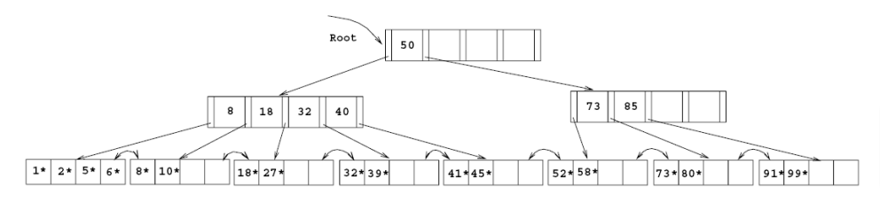

# P01
** See labwork.sqlite. Now assume that most requested query is  
`SELECT * FROM ticket_flights WHERE fare_conditions='Business'`  
* Measure how much time it take to process query.
* Add index (in dbbrowser you can add/delete with user interface) on fare_conditions and measure how it changes  
* Now remove index, and measure query  
`SELECT * FROM ticket_flights WHERE fare_conditions='Business' AND amount>10000`
* Add index on two columns (`fare_conditions`,`amount`) and measure after adding index
  

# P02
Understand hashing.  
Provided hash will be sum of each letter's order in alphabet and modulo by 10.  
h(apple) = (1+16+16+12+5) mod 5 = 50 mod 10 = 0

Your task is to create hash indexing for column `country`.  
Draw figure *(you can draw on paper and upload image of it, and/or  use services like Miro)* like in page 50 of `Chapter 11. Indexing and hashing`.   

|id |first_name|last_name|country         |gender|
|---|----------|---------|-------------|------|
|1  |Bobby     |La Vigne |Sweden       |M     |
|2  |Remy      |Flaws    |Poland       |F     |
|3  |Winni     |Delafont |Norway       |F     |
|4  |Cordelie  |Matokhnin|United States|F     |
|5  |Cathlene  |Hakewell |Mayotte      |F     |
|6  |Manda     |Esome    |Albania      |F     |
|7  |Kinna     |Tyndall  |Micronesia   |F     |
|8  |Currie    |Daintier |China        |M     |
|9  |Penelope  |Imlin    |Ecuador      |F     |
|10 |Shea      |Prestney |Brazil       |F     |
|11 |Rowan     |McCaskill|Portugal     |M     |
|12 |Wilfrid   |Harriss  |China        |M     |
|13 |Ruthann   |Kilbourne|Indonesia    |F     |
|14 |Adrea     |Drissell |Poland       |F     |
|15 |Creighton |Dornin   |Poland       |M     |
|16 |Casi      |Spondley |Pakistan     |F     |
|17 |Mal       |Ingliss  |Russia       |M     |
|18 |Bogey     |Hritzko  |Indonesia    |M     |
|19 |Karlan    |Gerring  |Brazil       |M     |
|20 |Dilan     |Orro     |China        |M     |

# P03 Evaluate B+ Tree

Consider the B+ tree index of order d = 2 shown in the figure below.  
a. Show the tree that would result from inserting a data entry with key 9 into this tree.  
b. Show the B+ tree that would result from inserting a data entry with key 3 into the original tree.     
c. Show the B+ tree that would result from deleting the data entry with key 8 from the original tree.  
e. Show the B+ tree that would result from starting with the original tree, inserting a data entry with key 46 and then deleting the data entry with key 52.  
f. Show the B+ tree that would result from deleting the data entry with key 91.  
g. Show the B+ tree that would result inserting a data entry with key 59, and then deleting the data entry with key 91.  